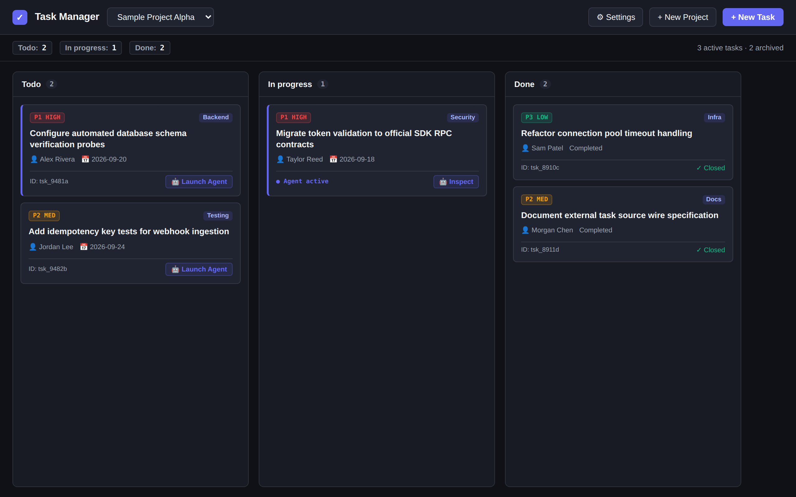
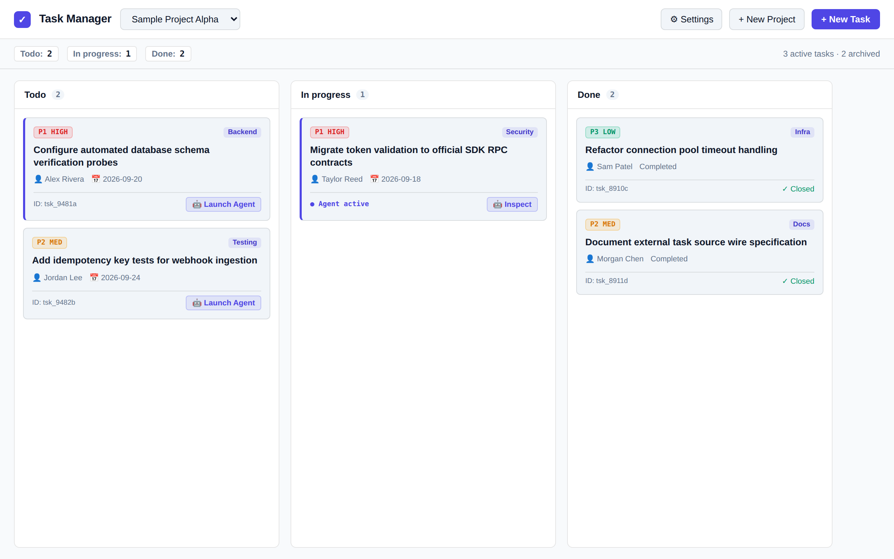
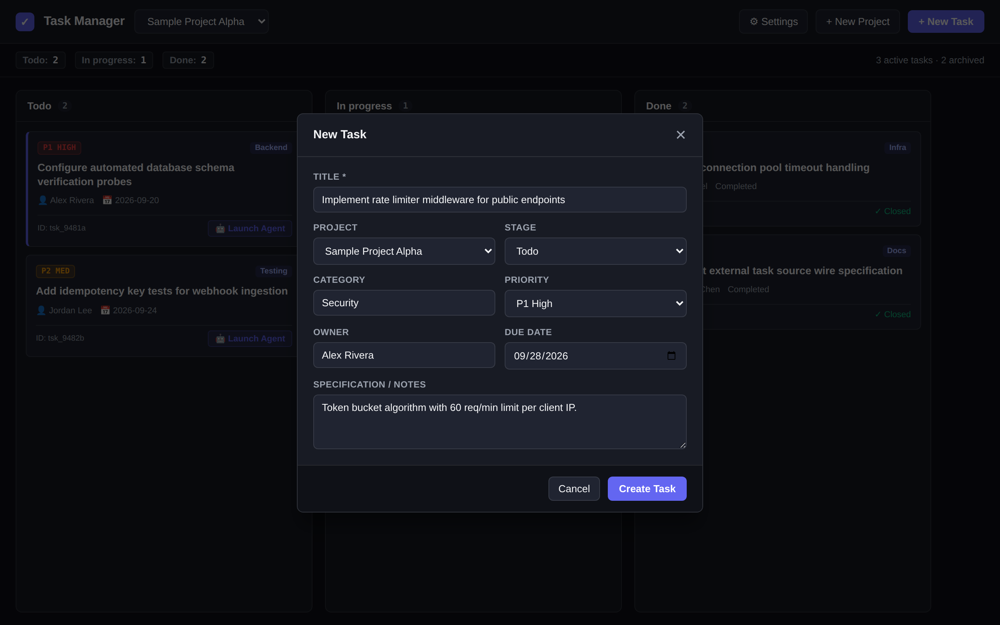
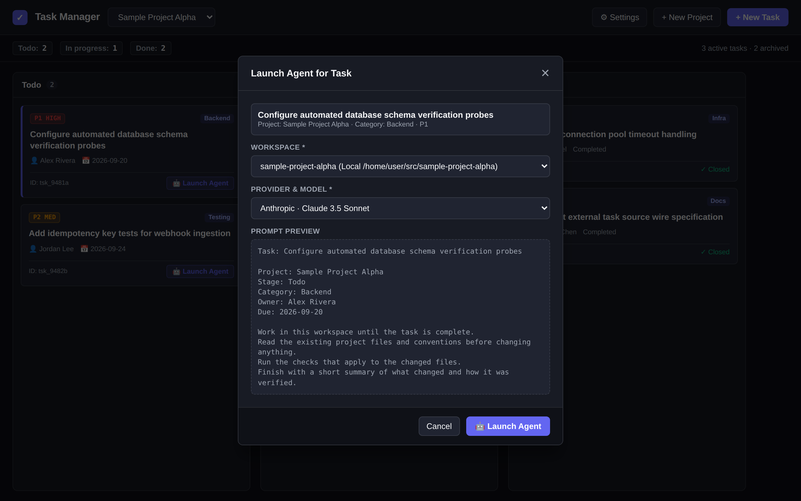
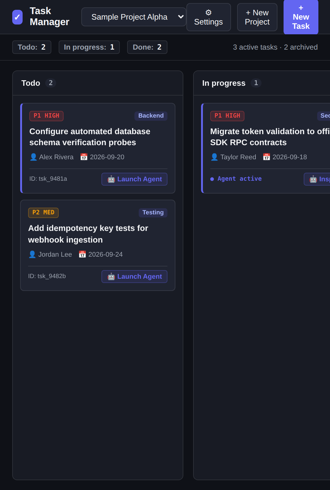

# Task Manager

Task Manager is a Paseo plugin for user-created task boards with configurable projects, custom stages, and explicit agent launching.



## Screenshots

| View | Dark Theme | Light Theme |
|:--|:--|:--|
| Board Overview |  |  |
| Dialogs |  |  |
| Compact View |  | |

## Requirements

- Paseo desktop application or daemon version 0.8.0 or newer.
- Node.js 20 or newer (for local development and test execution).

## Recommended Installation

Install the plugin from your local checkout or source directory:

```bash
paseo plugin install /path/to/paseo-task-manager --id paseo-task-manager
```

Verify that the plugin is running:

```bash
paseo plugin ls --json
```

Reload the plugin after updating local source code:

```bash
paseo plugin reload paseo-task-manager --json
```

## Empty First Use

When first installed, Task Manager opens with an empty board:
- No projects exist initially. Create your first project using the **+ New Project** button in the top bar.
- Board stages default to `Todo`, `In progress`, and `Done`.
- To create your first task, select your project and click **+ New Task**. Enter a title, select a stage, and optionally assign priority, category, owner, due date, specification notes, or reference links.

## Configuration and Defaults

### Stages

- Default stages are `Todo`, `In progress`, and `Done`.
- Custom stages can be configured in the **Settings** panel (gear icon). You can add, rename, or reorder stages.
- The last stage in the list is always treated as the completed stage. Tasks in the final stage count toward the Done total.
- Removing a stage moves any existing tasks in that stage to the nearest remaining stage so work is never lost.

### Projects

- Projects are user-created names with unique identifiers.
- Tasks are grouped by project. The project dropdown allows viewing tasks for a specific project or across all projects simultaneously.
- Deleting a project offers the choice to delete its tasks or reassign them to another project.

### Explicit Agent Launching

Task Manager allows launching Paseo coding agents directly from any task card:
1. Click **Launch Agent** on a task card.
2. Select an active Paseo workspace from the workspace dropdown. The plugin queries available workspaces through the Paseo SDK.
3. Select an enabled provider and model from the provider list.
4. Review the auto-generated prompt, which incorporates the task title, specification, stage, and reference links.
5. Click **Launch Agent**. No background agent is created until you explicitly confirm the dialog.

## Data, Network, and Permissions

- **Local Storage**: Board data is stored on disk in `~/.paseo/plugin-data/paseo-task-manager/board.json`. Preferences and source configuration are stored in `preferences.json` and `source.json` in the same directory.
- **Network Requests**: The plugin operates entirely offline by default. No unsolicited outbound network requests are made.
- **Optional External Source**: If you configure an external task endpoint in Settings, the plugin issues read-only HTTP GET requests to that specific endpoint. See [External Task Source Documentation](docs/external-source.md) for the wire schema.
- **Permissions**: The plugin runs within Paseo's local plugin runtime. It does not require special system privileges or external credentials.

## Update and Removal Retention

- To update the plugin, pull new changes and run `paseo plugin reload paseo-task-manager`.
- Updating the plugin code does not touch your stored board data in `~/.paseo/plugin-data/paseo-task-manager/`.
- To remove the plugin without deleting board data:
  ```bash
  paseo plugin remove paseo-task-manager
  ```
- To completely delete board data, manually remove the plugin data directory:
  ```bash
  rm -rf ~/.paseo/plugin-data/paseo-task-manager
  ```

## Troubleshooting

### Plugin Fails to Load

Inspect the plugin logs for runtime errors:

```bash
paseo plugin logs paseo-task-manager --json
```

Verify that the plugin path exists and dependencies are intact:

```bash
npm run typecheck
npm test
```

### Board File Recovery

If the board JSON file is corrupted, Task Manager moves the damaged file aside to `board.damaged.<timestamp>.json` and initializes a fresh board structure to prevent data loss. Check your data directory for damaged backups:

```bash
ls -la ~/.paseo/plugin-data/paseo-task-manager/
```

## Development and Screenshot Reproduction

Run the unit test suite:

```bash
npm test
```

Run TypeScript verification:

```bash
npm run typecheck
```

Run repository verification (package, docs, and secrets check):

```bash
npm run verify
```

Regenerate synthetic screenshots using Puppeteer:

```bash
node scripts/generate-screenshots.js
```

## License and Support

Distributed under the MIT License. See [LICENSE](LICENSE) for details. For issues or feature proposals, open an issue using the templates in [.github/ISSUE_TEMPLATE](.github/ISSUE_TEMPLATE).
