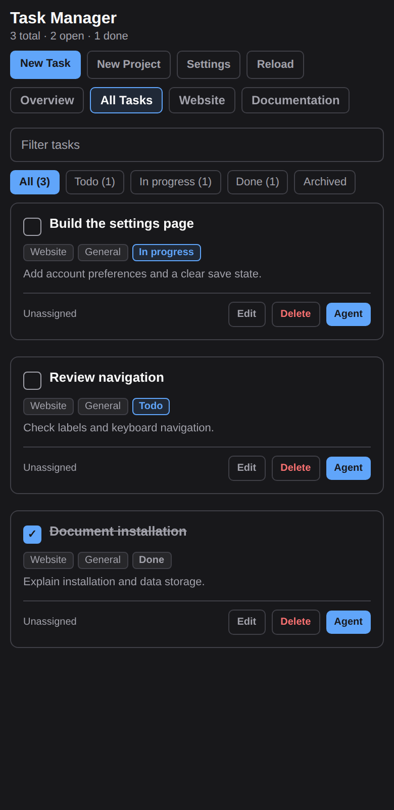
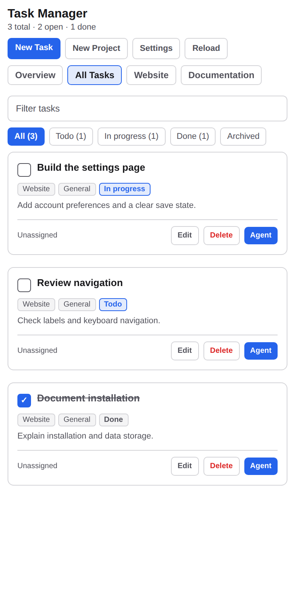

# Task Manager

A Paseo plugin for projects, tasks, custom stages, and explicit agent launching. The repository and runtime plugin ID are `paseo-task-manager`.


## Screenshots

These captures render the actual plugin components with sample data in an isolated local preview. The preview uses the real board handlers and temporary storage. Its workspace and provider options are examples; it cannot launch agents. It is not a screenshot of a connected user's Paseo session.

| View | Dark | Light |
|:--|:--|:--|
| Task cards |  |  |
| Compact |  |  |
| Dialogs |  |  |

## Requirements and installation

Use Paseo 0.8.0 or newer on both the daemon and the connected client. Local development and screenshot generation use Node.js 24 or newer.

From this checkout:

```bash
npm ci
npm run check
paseo plugin install . --id paseo-task-manager
paseo plugin ls --json
```

Paseo plugins are trusted, unsandboxed code. Install only source you trust. Paseo supplies the runtime SDK modules; the development dependencies support typechecking, tests, and screenshot generation.

## First use

1. Select **New Project** and enter a name. New installations have no projects or tasks.
2. Select **New Task**, choose a project, and enter a title. Category, stage, priority, owner, due date, specification, notes, and a reference link are available in the form.
3. Use the project tabs, stage buttons, and search field to filter tasks. **Overview** shows totals and project management controls.

The initial stages are `Todo`, `In progress`, and `Done`. Change their names and order in **Settings**. The last stage represents completion. Removing a stage moves its tasks to the nearest remaining stage.

Deleting a project requires confirmation and also deletes its local tasks. There is no automatic reassignment to another project. Rename and delete project controls are in **Overview**.

## Launch an agent

Select **Agent** on a task card. Choose an existing workspace and an enabled provider/model, then review the task prompt. The plugin creates an agent only when you select **Launch Agent** in that dialog. There is no default workspace, provider, or background agent launch.

## Storage and network access

- Board data is stored on the daemon host in `~/.paseo/plugin-data/paseo-task-manager/board.json`. `preferences.json` and `source.json` hold plugin settings.
- `PASEO_HOME` changes the Paseo home used for this path. `PASEO_TASK_MANAGER_DATA_DIR` overrides the plugin data directory directly.
- On POSIX systems, the plugin data directory is mode `0700`; board, settings, and recovery files are mode `0600`.
- No external task endpoint is configured by default. The plugin queries its connected Paseo daemon for workspace, provider, and agent metadata.
- An optional external source uses read-only HTTP GET requests. Requests occur when the board loads or refreshes. If the source fails, local tasks remain available and the board shows a warning. See the [external source contract](docs/external-source.md).
- The plugin needs no administrator privileges or additional credential store.

## Update, removal, and recovery

After updating the source, run:

```bash
npm ci
npm run check
paseo plugin reload paseo-task-manager
```

Reloading does not delete board data. Remove the plugin registration with:

```bash
paseo plugin remove paseo-task-manager
```

The data directory remains. Back it up before manually deleting it.

If the board cannot be parsed, the plugin preserves it as `board.corrupt-<timestamp>-<uuid>.json` in the same directory before loading an empty board. An unreadable file or a failed recovery rename raises an error rather than allowing an empty board to overwrite it. To recover, stop editing, keep the backup, repair its JSON, and restore it as `board.json`.

For load failures:

```bash
paseo plugin logs paseo-task-manager --json
npm run typecheck
```

## Development and release preparation

```bash
npm run check
npm run verify
node scripts/generate-screenshots.js
```

Screenshot generation bundles `client/board-view.tsx` and its child components through React Native Web. It does not use a separate HTML drawing. The temporary data directory is removed when capture ends.

`npm run verify` checks package identity, full semver validity, lockfile versions, the current changelog entry, local documentation links, and selected credential/path patterns. A passing scan is not proof that all private data has been removed. Review publication files and images as well.

The **Release PR** workflow is manually dispatched, requires release notes, and defaults to a dry run. A non-dry run prepares versions and a changelog entry in a review pull request. It does not publish, deploy, or change repository visibility. To prepare a local version without Git mutations:

```bash
RELEASE_NOTES='Describe the user-visible changes.' node scripts/prepare-release.mjs patch
```

## License and support

[MIT License](LICENSE). Use the [issue templates](.github/ISSUE_TEMPLATE) for bugs or feature requests. See [SECURITY.md](SECURITY.md) for security reporting.
